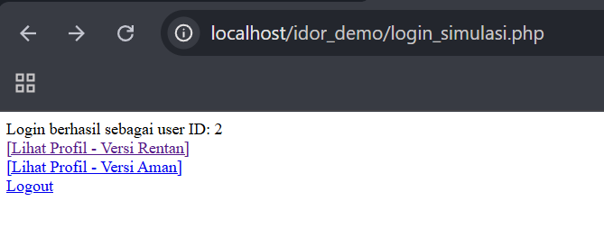
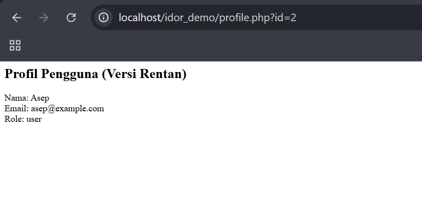
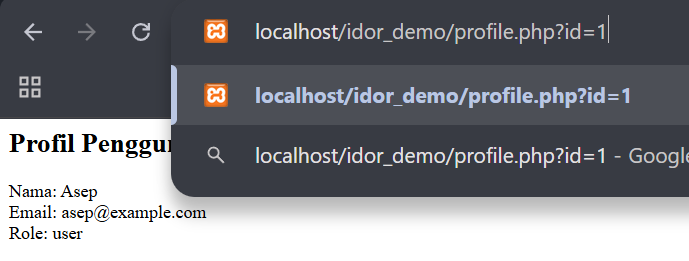
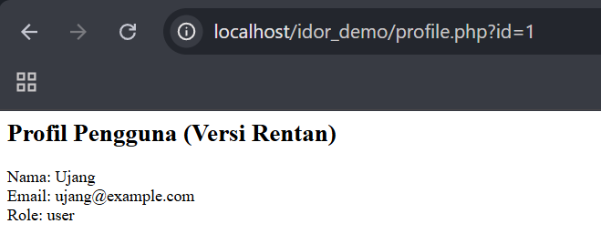
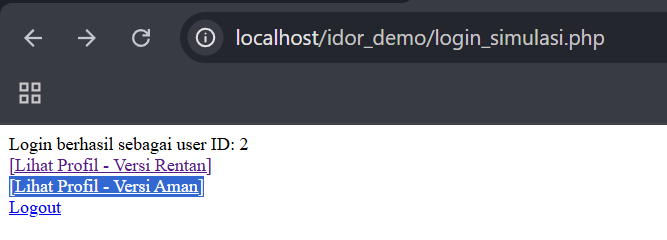
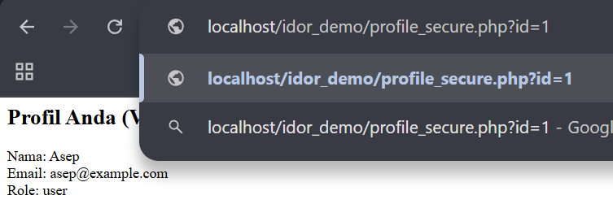
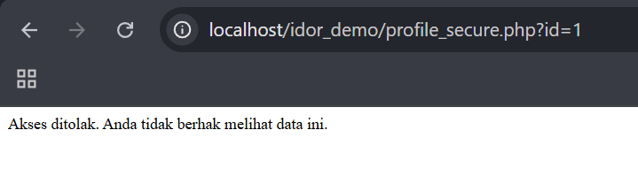

# IDOR (Insecure Direct Object Reference) demo
IDOR adalah kerentanan keamanan web yang terjadi ketika aplikasi mengizinkan akses langsung ke objek (seperti ID pengguna, file, atau data lain) tanpa validasi hak akses yang memadai. Hal ini memungkinkan penyerang untuk mengakses atau memodifikasi data milik pengguna lain hanya dengan mengubah parameter di URL atau input lainnya. <br>

Misalkan sebuah URL:
```
https://example.com/profile?id=1
```
Jika pengguna cukup mengganti ```id=1``` menjadi ```id=2``` dan berhasil melihat profil pengguna lain tanpa validasi otorisasi, maka aplikasi tersebut rentan terhadap IDOR.
### Link Artikel
[klik link disini](https://medium.com/@zakyputra628/idor-ketika-url-bisa-jadi-kunci-untuk-bobol-data-orang-lain-7b68073f56d0)<br>
# Eksperimen sederhana Pemahaman Kerentanan IDOR
## Buat Databases Dummy di mysql
```
-- Membuat database baru
CREATE DATABASE idor_demo;

-- Menggunakan database yang baru dibuat
USE idor_demo;

-- Membuat tabel users
CREATE TABLE users (
    id INT AUTO_INCREMENT PRIMARY KEY,
    name VARCHAR(100),
    email VARCHAR(100),
    role VARCHAR(50)
);

-- Menambahkan data ke dalam tabel users
INSERT INTO users (name, email, role) VALUES
    ('Ujang', 'ujang@example.com', 'user'),
    ('Asep', 'asep@example.com', 'user'),
    ('Gracie', 'gracie@example.com', 'admin');
```
## Buat File Code Program
### (db.php) File koneksi database:
```php
<?php
$host = "localhost";
$user = "root";
$pass = "";
$db = "idor_demo";

$conn = new mysqli($host, $user, $pass, $db);

if ($conn->connect_error) {
    die("Koneksi gagal: " . $conn->connect_error);
}
?>
```
### (profile.php) Halaman profil yang rentan terhadap IDOR:
```php
<?php
include 'db.php';

// Ambil ID dari URL dan cast ke integer agar sedikit lebih aman
$id = isset($_GET['id']) ? (int) $_GET['id'] : 0;

$sql = "SELECT * FROM users WHERE id = $id";
$result = $conn->query($sql);

if ($result->num_rows == 1) {
    $user = $result->fetch_assoc();
    echo "<h2>Profil Pengguna (Versi Rentan)</h2>";
    echo "Nama: " . htmlspecialchars($user['name']) . "<br>";
    echo "Email: " . htmlspecialchars($user['email']) . "<br>";
    echo "Role: " . htmlspecialchars($user['role']) . "<br>";
} else {
    echo "User tidak ditemukan.";
}
?>
```
### (profile_secure.php) Halaman profil dengan perlindungan terhadap IDOR:
```php
<?php
session_start();
include 'db.php';

// Simulasi: hanya user yang sedang login boleh akses datanya sendiri
$user_id = $_SESSION['user_id'] ?? null;
$id = isset($_GET['id']) ? (int) $_GET['id'] : 0;

// Validasi: ID di URL harus sesuai dengan sesi login
if ($user_id === null || $id !== $user_id) {
    die("Akses ditolak. Anda tidak berhak melihat data ini.");
}

$sql = "SELECT * FROM users WHERE id = $id";
$result = $conn->query($sql);

if ($result->num_rows == 1) {
    $user = $result->fetch_assoc();
    echo "<h2>Profil Anda (Versi Aman)</h2>";
    echo "Nama: " . htmlspecialchars($user['name']) . "<br>";
    echo "Email: " . htmlspecialchars($user['email']) . "<br>";
    echo "Role: " . htmlspecialchars($user['role']) . "<br>";
} else {
    echo "Data tidak ditemukan.";
}
?>
```
### (login_simulasi.php) Simulasi proses login:
```php
<?php
session_start();

// Simulasi login: user dengan ID 2 (asep)
$_SESSION['user_id'] = 2;

echo "Login berhasil sebagai user ID: " . $_SESSION['user_id'];
echo "<br><a href='profile.php?id=2'>[Lihat Profil - Versi Rentan]</a>";
echo "<br><a href='profile_secure.php?id=2'>[Lihat Profil - Versi Aman]</a>";
echo "<br><a href='logout.php'>Logout</a>";
?>
```
## Langkah-langkah Simulasi
### Mengakses Aplikasi:
- Jalankan login_simulasi.php untuk melakukan "login" sebagai Asep (ID 2)
- Aplikasi akan menampilkan dua link: versi rentan dan versi aman

### Pengujian Versi Rentan:
- Klik link “Lihat Profil — Versi Rentan” untuk melihat profil Asep
- Ubah parameter URL dari id=2 menjadi id=1 (Ujang) atau id=3 (Gracie)
- Anda akan melihat bahwa versi rentan menampilkan data pengguna lain tanpa validasi



### Pengujian Versi Aman:
- Klik link “Lihat Profil — Versi Aman” untuk melihat profil Asep
- Ubah parameter URL dari id=2 menjadi id=1 atau id=3
- Versi aman akan menampilkan pesan “Akses ditolak” karena adanya validasi




## Cara Pencegahan IDOR dalam Kode
Dari kode simulasi di atas, kita dapat mengidentifikasi beberapa teknik pencegahan IDOR yang diterapkan dalam profile_secure.php:
### Verifikasi Identitas Pengguna:
Aplikasi memastikan pengguna telah login (memiliki session) dan mengambil ID pengguna dari session, bukan hanya dari input pengguna.
```php
$user_id = $_SESSION['user_id'] ?? null;
$id = isset($_GET['id']) ? (int) $_GET['id'] : 0;
```
### Validasi Akses Berdasarkan Kepemilikan:
Bagian ini adalah kunci utama pencegahan IDOR. Aplikasi memeriksa apakah ID yang diminta (dari URL) sesuai dengan ID pengguna yang sedang login. Jika tidak sesuai, akses ditolak.
```php
if ($user_id === null || $id !== $user_id) {
    die("Akses ditolak. Anda tidak berhak melihat data ini.");
}
```
### Penggunaan Session untuk Menyimpan Status Autentikasi:
Aplikasi menggunakan session untuk melacak identitas pengguna yang telah terautentikasi, bukan hanya mengandalkan parameter dari URL.
```php
session_start();
// ...menggunakan $_SESSION['user_id']
```
Simulasi ini menunjukkan dengan jelas perbedaan antara aplikasi yang rentan terhadap IDOR dan aplikasi yang menerapkan perlindungan yang tepat. Prinsip utama dalam pencegahan IDOR adalah selalu memvalidasi bahwa pengguna yang sedang login memiliki hak untuk mengakses resource yang diminta, tidak hanya mengandalkan parameter input yang dapat dimanipulasi oleh pengguna.

## Referensi
- [OWASP Foundation.(2021).A01:2021—Broken Access Control.OWASP Top 10.](https://owasp.org/Top10/A01_2021-Broken_Access_Control/)<br>
- [PortSwigger Web Security Academy.Insecure Direct Object References (IDOR).](https://portswigger.net/web-security/access-control/idor)<br>
- [Secure Code Network.(2023).Penjelasan sederhana tentang IDOR (insecure direct object reference) | Web Penetration Testing](https://youtu.be/B1eOadGZ7sQ?si=7glwIGQnrxjdZBUj )<br>
- [Pejuang Siber.(2023).Membongkar Celah IDOR: Akses Data Rahasia Tanpa Login!](https://youtu.be/N7StY5aPTTU)<br>
